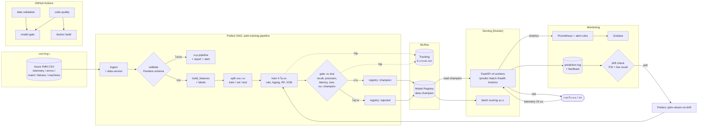

# สถาปัตยกรรมระบบ

(เจ้าของ: คนที่ 1) ภาพรวมทั้งระบบ: ข้อมูลไหลจากข้อมูลดิบผ่าน Prefect DAG ไปจนถึง API ที่ให้บริการ แล้ว log จากการใช้งานจริงย้อนกลับมาที่ monitoring เพื่อสั่งเทรนใหม่

## จุดสำคัญที่ต้องอธิบายได้

| ประเด็น | กลไก | ไฟล์ |
|---|---|---|
| กัน Training-Serving Skew | API เรียก `build_features()` ฟังก์ชันเดียวกับตอนเทรน, preprocessing อยู่ใน sklearn `Pipeline` ที่บันทึกเป็น artifact เดียว, cleaning ใช้ค่าคงที่จาก config ไม่ fit จากข้อมูล | `features/build.py`, `modeling/models.py`, `tests/test_skew.py` |
| ข้อมูลเสียทำให้ระบบหยุด | `validate_or_raise()` raise exception ทำให้ Prefect flow หยุด, เขียน report, ส่ง webhook | `validation/validate.py` |
| ทำซ้ำได้ | split ตามวันที่ใน config, `seed: 42`, data version = hash ของไฟล์, เวอร์ชันไลบรารีครบใน `requirements.lock` | `configs/params.yaml` |
| ด่านตรวจก่อนขึ้นใช้งาน | gate 5 ข้อบน test set, โมเดลที่ไม่ผ่านถูกเก็บใน registry เป็น `rejected` | `registry/evaluate.py`, `registry/register.py` |
| ย้อนกลับ | ย้าย alias `champion` ไปเวอร์ชันก่อนหน้า, API ทุก worker poll registry ทุก 15 วินาที | `registry/register.py`, `serving/app.py` |
| รูปแบบการให้บริการ | real-time (เครื่องเดียว) + batch ทุกกะ (ทั้งโรงงาน), 4 worker process เพื่อเลี่ยง GIL | `serving/app.py`, `serving/batch.py` |
| แยก Data Drift กับ Concept Drift | data drift = PSI ของ input, concept drift = live recall ตกแต่ input ปกติ | `monitoring/monitor.py`, `monitoring/retrain_policy.py` |
