# รายงานโครงงาน: ระบบทำนายเครื่องจักรเสียล่วงหน้า (Predictive Maintenance)

รายวิชา CP413008 Machine Learning Engineering for Production ภาคเรียนที่ 1 ปีการศึกษา 2569

> ตัวเลขทั้งหมดในรายงานนี้มาจากการรันบนข้อมูลจริง (Microsoft Azure Predictive Maintenance) ไฟล์ผลลัพธ์อยู่ใน `docs/evidence/`
> ส่วนที่เขียนว่า **[ภาพ: ...]** ให้เจ้าของส่วนแทรกภาพหน้าจอจากระบบที่รันจริง

## 1. ปัญหา ผู้ใช้ และคุณค่า

เมื่อเครื่องจักรในสายการผลิตเสียโดยไม่มีสัญญาณเตือน สายการผลิตต้องหยุดทันที ช่างต้องซ่อมแบบฉุกเฉิน และบางครั้งต้องรออะไหล่ ระบบนี้ทำนายว่าแต่ละเครื่องจะเสียภายใน 24 ชั่วโมงข้างหน้าหรือไม่ ฝ่ายซ่อมบำรุงจึงเปลี่ยนการซ่อมฉุกเฉินเป็นการซ่อมตามแผนได้

**ผู้ใช้และผู้มีส่วนได้ส่วนเสีย:**
- ช่างซ่อมบำรุง: ใช้รายการเครื่องเสี่ยงทุกต้นกะ
- หัวหน้าฝ่ายผลิต: วางแผนกำลังผลิตเมื่อต้องหยุดเครื่อง
- ฝ่ายจัดซื้ออะไหล่: เตรียมชิ้นส่วนล่วงหน้า

**ทำไมใช้ ML แทนการเขียนกฎ:** อาการก่อนเสียเกิดจากหลายสัญญาณร่วมกัน ได้แก่ error หลายชนิด, ค่าเซนเซอร์ที่ค่อยๆ เปลี่ยน และอายุของชิ้นส่วน และแต่ละชิ้นส่วนเสียด้วยรูปแบบต่างกัน เราทดลองใช้กฎ "เตือนเมื่อ vibration เฉลี่ย 24 ชม. สูง" เป็น baseline ได้ PR-AUC เพียง 0.088 ขณะที่โมเดล ML ได้ 0.999 (ตารางในหัวข้อ 6)

AI Project Canvas ฉบับเต็มอยู่ที่ [ai_project_canvas.md](ai_project_canvas.md)

### คำถามตรวจสอบหัวข้อ

| คำถาม | คำตอบ |
|---|---|
| ถ้าโมเดลทำนายผิด ใครเดือดร้อน | **False Negative** (ไม่เตือนแต่เครื่องเสีย): สายการผลิตหยุดกะทันหัน สมมติความเสียหาย 50,000 บาท/ครั้ง **False Positive** (เตือนแต่ไม่เสีย): ส่งช่างไปตรวจโดยไม่จำเป็น สมมติ 5,000 บาท/ครั้ง |
| ตัวชี้วัดธุรกิจเชื่อมกับตัวชี้วัดโมเดลอย่างไร | ต้นทุนรวม = FN × 50,000 + FP × 5,000 บาท ซึ่งใช้เลือก threshold โดยตรง (หัวข้อ 2) และรายงานเป็นเงินที่ประหยัดได้เทียบกับไม่มีโมเดล |
| ข้อมูลจะเปลี่ยนไปอย่างไร | **Data drift:** เปลี่ยนรุ่นหรือ calibrate เซนเซอร์ใหม่, ฤดูกาล, สัดส่วนรุ่นเครื่องในโรงงานเปลี่ยน **Concept drift:** ชิ้นส่วนล็อตใหม่เสียด้วยสาเหตุใหม่, นโยบายการซ่อมเปลี่ยน |
| ต้องตอบเร็วแค่ไหน รองรับคำขอเท่าใด | 100 เครื่อง × 1 ครั้ง/ชม. ≈ 0.03 req/s ช่วงพีคคือสั่งประเมินทั้งโรงงานพร้อมกัน ตั้ง SLO ไว้ที่ p95 < 100 ms (หัวข้อ 8) |
| ถ้าโมเดลใหม่แย่กว่าเดิม รู้และย้อนกลับอย่างไร | **ก่อนขึ้นใช้งาน:** gate เทียบ PR-AUC กับ champion บน test set เดียวกัน ถ้าแย่กว่าจะไม่ promote **หลังขึ้นใช้งาน:** สั่ง `make rollback` ย้าย alias `champion` กลับเวอร์ชันก่อนหน้า API ทุก worker โหลดเวอร์ชันนั้นภายใน 15 วินาที (หัวข้อ 7) |

## 2. ตัวชี้วัด

| ประเภท | ตัวชี้วัด | เหตุผล |
|---|---|---|
| Optimizing metric | PR-AUC บน validation | คลาสไม่สมดุลมาก (positive 1.8–2.0%) accuracy จึงไม่มีความหมาย ส่วน PR-AUC วัดความสามารถในการจับคลาสที่หายากโดยไม่ขึ้นกับ threshold |
| Gating metric | Recall ≥ 0.80 | ต้องจับเครื่องที่จะเสียได้อย่างน้อย 80% เพราะ FN แพงที่สุด |
| | Precision ≥ 0.50 | การเตือนแต่ละครั้งต้องถูกอย่างน้อยครึ่งหนึ่ง ไม่อย่างนั้นช่างจะเลิกเชื่อระบบ |
| | p95 latency < 100 ms | ตามที่ SLO กำหนด |
| | ขนาดโมเดล < 50 MB | โหลดเร็วและรันบน edge server ของโรงงานได้ |
| | PR-AUC ≥ champion | ห้ามขึ้นใช้งานโมเดลที่แย่กว่าตัวที่ใช้อยู่ |
| ตัวชี้วัดธุรกิจ | ต้นทุนรวม (บาท), เงินที่ประหยัดได้, จำนวนครั้งที่เครื่องเสียโดยไม่มีการเตือน | ผู้บริหารเข้าใจได้ทันที |

**การเลือก threshold:** ไม่ใช้ 0.5 แต่ลองทุกค่าตั้งแต่ 0.02 ถึง 0.98 บน validation แล้วเลือกค่าที่ต้นทุนรวมต่ำสุด โดยต้องผ่าน recall และ precision ตามเกณฑ์ gate บวก margin 0.05 เผื่อค่าแกว่งเมื่อไปเจอ test set

## 3. ข้อมูล

**แหล่งข้อมูล:** Microsoft Azure Predictive Maintenance (ข้อมูลจำลองที่ Microsoft เผยแพร่) ประกอบด้วย 100 เครื่อง ตลอดปี 2015

ปี 2026 ที่ตั้งเดิมของ Microsoft ปิดไปแล้ว ระบบจึงลองดาวน์โหลดตามลำดับ: แหล่งของ Microsoft ก่อน ถ้าไม่ได้จึงใช้สำเนาบน GitHub 2 แห่ง ซึ่งไฟล์มีขนาดตรงกันทุกไฟล์ และจำนวนแถวตรงกับที่ Microsoft ระบุไว้

| ตาราง | แถว | เนื้อหา |
|---|---|---|
| telemetry | 876,100 | volt, rotate, pressure, vibration รายชั่วโมง |
| errors | 3,919 | error1–error5 |
| maint | 3,286 | การเปลี่ยนชิ้นส่วน comp1–comp4 |
| failures | 761 | การเสียของแต่ละชิ้นส่วน (comp2 259, comp1 192, comp4 179, comp3 131) |
| machines | 100 | รุ่น (model1–4) และอายุ |

**Label:** `will_fail_24h = 1` เมื่อเครื่องนั้นเสียในช่วง (t, t+24 ชม.] เก็บข้อมูลทุก 3 ชม. เพราะแถวที่ติดกันแทบเหมือนกัน

**การแบ่งข้อมูลตามเวลา** (ไม่สุ่ม เพื่อกันข้อมูลอนาคตรั่วเข้ามา และจำลองการใช้งานจริงที่เทรนด้วยอดีตแล้วทำนายอนาคต):

| ชุด | ช่วงเวลา | แถว | positive | อัตรา |
|---|---|---|---|---|
| train | 2 ม.ค. – 31 ส.ค. 2015 | 193,400 | 3,790 | 1.96% |
| validation | 1 ก.ย. – 31 ต.ค. 2015 | 48,800 | 908 | 1.86% |
| test | 1 พ.ย. 2015 – 1 ม.ค. 2016 | 49,100 | 894 | 1.82% |

**การทำซ้ำได้:**
- เวอร์ชันข้อมูล = MD5 ของไฟล์ดิบ ได้ `9e1e9ec1f79c` ทั้งตอนรันบนเครื่องและตอนรันใน Docker
- ช่วงวันที่อยู่ใน `configs/params.yaml`
- `seed = 42`
- เวอร์ชันไลบรารีล็อกไว้ใน `requirements.lock`

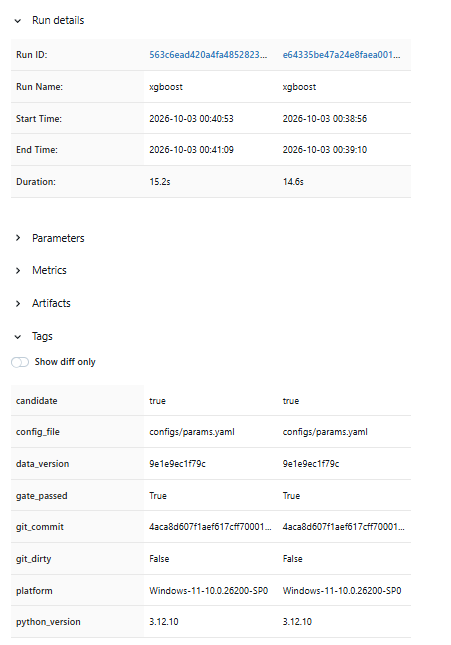

**ข้อจำกัด:** ข้อมูลเป็นข้อมูลสังเคราะห์และมีเพียง 1 ปี รูปแบบการเสียจึงชัดเจนกว่าโรงงานจริงมาก ผลในหัวข้อ 6 จึงเป็นค่าที่ดีเกินจริงสำหรับการใช้งานจริง

## 4. Schema และการตรวจจับความผิดปกติ

Schema เขียนด้วย Pandera (`src/pdm/validation/schema.py`) ตรวจทุกตาราง:

| สิ่งที่ตรวจ | ตัวอย่าง |
|---|---|
| ชนิดข้อมูล | volt ต้องเป็นตัวเลข |
| ช่วงค่าที่เป็นไปได้ทางกายภาพ | vibration 0–150, rotate 0–1,000 |
| ค่าที่อนุญาต | model1–4, error1–5, comp1–4 |
| ห้ามซ้ำ | (machineID, datetime) |
| สัดส่วนค่าหาย | ไม่เกิน 5% |
| ข้ามตาราง | เครื่องใน telemetry ต้องมีในตาราง machines |

**เมื่อพบข้อมูลเสีย:**
1. เขียน report JSON
2. log ระดับ ERROR
3. ส่ง webhook ถ้าตั้งค่าไว้
4. raise `DataValidationError` ทำให้ Prefect flow หยุด ไม่มีการเทรนต่อ

**สาธิตด้วยข้อมูลเสีย 7 แบบที่สร้างจากข้อมูลจริง** (`make bad-data`) ระบบจับได้ทุกแบบ (report อยู่ใน `docs/evidence/validation/`):

| กรณี | สิ่งที่ตรวจพบ |
|---|---|
| ไม่มีคอลัมน์ vibration | column missing |
| volt เป็นข้อความ | dtype ผิด |
| vibration ติดลบ 25 แถว | in_range(0, 150) |
| rotate = 5,000 | in_range(0, 1000) |
| pressure หาย 10% | sensor null fraction > 5% |
| แถวซ้ำ 50 แถว | multiple_fields_uniqueness |
| machineID = 999 | in_range + unknown machine |

ระหว่างพัฒนาเจอ bug 2 จุดจากการทดสอบเหล่านี้ และแก้แล้ว:
1. Pandera ข้ามค่า null ก่อนรัน check ของคอลัมน์ที่ `nullable=True` จึงต้องย้ายการเช็กสัดส่วน null ไปตรวจระดับ DataFrame
2. `read_csv` แปลง "N/A" เป็น NaN อัตโนมัติ ข้อมูลเสียแบบนี้จึงหลุดการเช็กชนิดข้อมูล

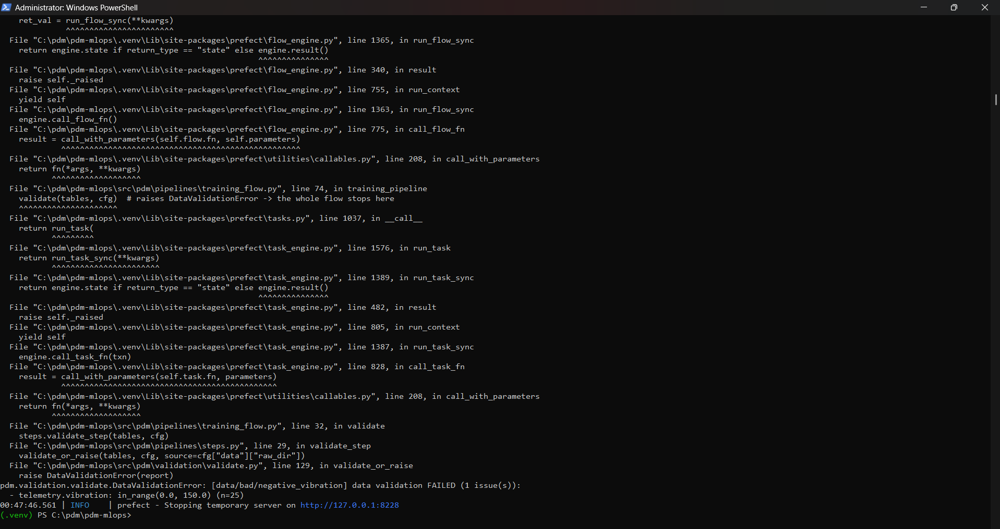

**การจัดการค่าหายและ outlier** (`cleaning.py`):

| กรณี | วิธีจัดการ |
|---|---|
| ค่าหายช่วงสั้น | forward-fill ไม่เกิน 3 ชม. ต่อเครื่อง |
| ค่าที่ยังหายอยู่ | เติมด้วยกึ่งกลางของช่วงปกติ |
| outlier ที่ยังเป็นไปได้ | clip ไว้ในช่วงปกติ (ค่าจาก EDA: min–max ของข้อมูลจริง) |
| ค่าที่เป็นไปไม่ได้ | reject ตั้งแต่ขั้น schema |

ทุกค่าคงที่มาจาก config ไม่ได้ fit จากข้อมูล เพราะ median ของ request 24 แถวไม่เท่ากับ median ของชุดเทรน

## 5. การกัน Training-Serving Skew

1. **Feature function เดียว:** `build_features()` (`src/pdm/features/build.py`) เป็นโค้ดชุดเดียวที่ทั้ง pipeline เทรน, API และ batch scoring เรียกใช้
2. **Preprocessing อยู่กับโมเดล:** imputer, scaler และ one-hot อยู่ใน sklearn `Pipeline` เดียวกับโมเดล บันทึกเป็น artifact เดียว
3. **Cleaning ไม่ fit จากข้อมูล:** ใช้ค่าคงที่จาก config ทั้งหมด
4. **Schema ร่วมกัน:** API ใช้ `HARD_BOUNDS` ชุดเดียวกับ schema ของข้อมูลเทรน
5. **API ไม่เก็บ state:** client ส่ง telemetry 24 ชม. ล่าสุดมาใน request API จึงคำนวณ rolling feature ด้วยโค้ดเดียวกับตอนเทรน
6. **มี test พิสูจน์:** `tests/test_skew.py` สร้าง JSON request จากข้อมูลดิบ ส่งผ่านเส้นทางของ API แล้วเทียบกับแถวเดียวกันในตารางที่ใช้เทรน ค่าตรงกันทุก feature ที่ rtol 1e-9

## 6. Baseline และการทดลอง

**Feature 31 ตัว:**
- rolling mean/std 3 ชม. และ 24 ชม. ของ 4 เซนเซอร์ (16)
- จำนวน error แต่ละชนิดใน 24 ชม. (5)
- จำนวนวันตั้งแต่ซ่อมชิ้นส่วนแต่ละชิ้น (4)
- อายุเครื่อง และรุ่นเครื่องแบบ one-hot

**ผลบน validation:** threshold เลือกจากต้นทุน

| รอบ | โมเดล | PR-AUC | Recall | Precision | ต้นทุน val (บาท) |
|---|---|---|---|---|---|
| 0 | Rule baseline (vibration เฉลี่ย 24 ชม.) | 0.088 | 0.258 | 0.192 | 38,620,000 |
| 1 | Logistic Regression | 0.817 | 0.998 | 0.686 | 2,170,000 |
| 2 | Random Forest (200 ต้น) | 0.9997 | 1.000 | 0.995 | 25,000 |
| 3 | XGBoost (300 ต้น, depth 5) | **0.9999** | 1.000 | 0.985 | 70,000 |

**การตัดสินใจจากผลการทดลอง:**
1. **กฎธรรมดาใช้ไม่ได้:** baseline จับได้แค่ 26% ของเครื่องที่จะเสีย ยืนยันว่าต้องใช้ ML
2. **ต้องใช้โมเดลที่จับความสัมพันธ์แบบไม่เป็นเส้นตรง:** Logistic Regression ดีขึ้นมาก แต่ precision 0.69 ยังทำให้เตือนผิดบ่อย เพราะความสัมพันธ์ระหว่าง error กับชิ้นส่วนไม่เป็นเส้นตรง จึงไปต่อที่ tree model
3. **เลือก XGBoost:** RF กับ XGBoost ต่างกันน้อยมาก XGBoost ชนะใน optimizing metric (PR-AUC) และเล็กกว่ามาก (0.54 MB เทียบกับ RF ประมาณ 8 MB) จึงเร็วกว่าตอนให้บริการ
4. **ผลบน test set** (gate, `docs/evidence/gate/initial_training_gate.json`):
   - recall 0.997, precision 0.957, PR-AUC 0.999
   - FN 3 ครั้ง, FP 40 ครั้ง จาก 49,100 แถว (2 เดือน, 100 เครื่อง)
   - ต้นทุน 350,000 บาท เทียบกับ 44,700,000 บาทถ้าไม่มีโมเดล

**ผลดีผิดปกติ จึงตรวจ leakage:** เทรน XGBoost แยกทีละกลุ่ม feature ได้ test PR-AUC ดังนี้
- เซนเซอร์อย่างเดียว: 0.25
- error อย่างเดียว: 0.69
- days_since อย่างเดียว: 0.31

ไม่มี feature ใดเดี่ยวๆ ที่บอกคำตอบได้ และทุก feature ใช้เฉพาะข้อมูล ณ เวลา t หรือก่อนหน้า ผลที่สูงเกิดจากการรวมสัญญาณหลายกลุ่ม ซึ่งเป็นลักษณะของข้อมูลจำลองชุดนี้

**การอธิบายผล (feature importance ของ XGBoost):**

| อันดับ | feature | importance |
|---|---|---|
| 1 | error3 ใน 24 ชม. | 0.255 |
| 2 | error1 ใน 24 ชม. | 0.175 |
| 3 | error5 ใน 24 ชม. | 0.171 |
| 4 | error4 ใน 24 ชม. | 0.165 |
| 5 | volt เฉลี่ย 24 ชม. | 0.050 |

error ก่อนหน้าเป็นสัญญาณหลัก ส่วนเซนเซอร์ช่วยระบุว่าชิ้นส่วนไหนจะเสีย

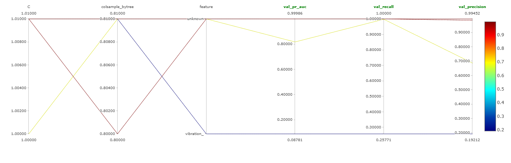

| Rule baseline | Logistic Regression | Random Forest | XGBoost |
|---|---|---|---|
| 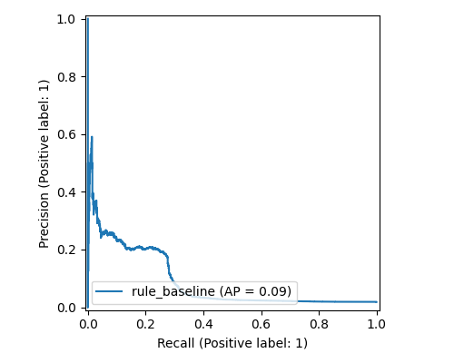 | 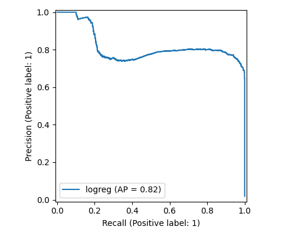 | 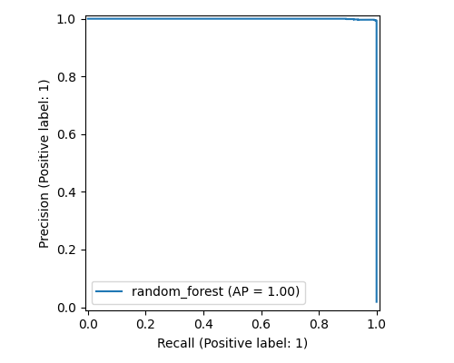 | 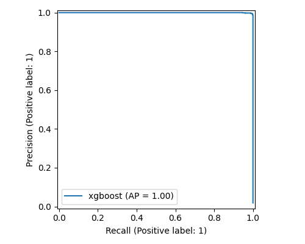 |

## 7. Experiment Tracking และ Model Registry

**MLflow บันทึก 6 อย่างในทุก run:**

| สิ่งที่ต้องบันทึก | บันทึกเป็น |
|---|---|
| เวอร์ชันโค้ด | tag `git_commit`, `git_dirty` |
| เวอร์ชันข้อมูล | tag `data_version` |
| ไฮเปอร์พารามิเตอร์ | params รวม `threshold` และ `seed` |
| ตัวชี้วัด | `val_*`, `test_*`, latency, ขนาดโมเดล |
| ไฟล์ผลลัพธ์ | โมเดล, PR curve, confusion matrix, feature importance, gate report |
| สภาพแวดล้อม | Python version, platform, `pip freeze`, config ที่ใช้ |

**Registry:** ลงทะเบียนทุก candidate แม้ไม่ผ่าน gate และเก็บสถานะใน tag `status`:
- `champion`
- `rejected` (พร้อมเหตุผลว่าไม่ผ่านข้อไหน)
- `archived`
- `rolled_back`

alias `champion` ชี้ไปเวอร์ชันที่ API ใช้จริง

**ด่านตรวจก่อนอนุมัติ:** gate 5 ข้อในหัวข้อ 2 รันบน test set ที่ไม่เคยใช้ในการเทรน

**สาธิต rollback:** สั่ง `make rollback` ย้าย alias กลับเวอร์ชันก่อนหน้า ตั้ง status ให้ทั้ง 2 เวอร์ชัน แล้วแจ้ง API ให้ reload ระบบไม่ต้อง build หรือ deploy ใหม่

[ภาพ: MLflow compare runs, หน้า registry ที่มี champion / archived / rolled_back]

## 8. การให้บริการและโครงสร้างพื้นฐาน

**API** (FastAPI ใน Docker): `/predict`, `/predict/batch`, `/feedback`, `/health`, `/ready`, `/metrics`, `/model`, `/admin/reload`

- ตรวจ input ด้วย Pydantic
- ข้อมูลผิดได้ 422 พร้อมบอก field ที่ผิด
- ทดสอบ input ผิด 8 แบบใน `tests/test_api.py`

**รูปแบบการให้บริการ:**

| รูปแบบ | ใช้เมื่อ | ทำไม |
|---|---|---|
| Real-time (`/predict`) | gateway ของเครื่องส่ง telemetry ทุกชั่วโมง | ได้ผลทันทีเมื่อเครื่องเริ่มมีอาการ |
| Batch ทุกกะ (`make batch`) | ต้นกะ จัดอันดับทั้งโรงงาน 100 เครื่อง | หัวหน้าช่างวางแผนงานทั้งกะได้ในครั้งเดียว |

**SLO:** p95 latency ของ `/predict` < 100 ms, error rate < 1%, availability ≥ 99%

**ผลวัดใน Docker** (gunicorn 4 worker, ข้อมูลจริง, `docs/evidence/slo/`):

| concurrency | throughput | p50 | p95 | p99 | error | SLO |
|---|---|---|---|---|---|---|
| 1 | 37.5 req/s | 26.7 ms | 32.4 ms | 37.1 ms | 0% | ผ่าน |
| 4 | 157.2 req/s | 24.6 ms | 30.0 ms | 36.1 ms | 0% | ผ่าน |
| 8 | 24.2 req/s | 150.2 ms | 375.2 ms | 413.6 ms | 0% | ไม่ผ่าน |
| 16 | 32.1 req/s | 399.7 ms | 530.2 ms | 589.7 ms | 0% | ไม่ผ่าน |

ความต้องการจริงประมาณ 0.03 req/s ระดับที่ผ่าน SLO (ประมาณ 157 req/s) จึงสูงกว่าที่ต้องการหลายพันเท่า

**ปัญหาประสิทธิภาพที่พบระหว่างวัด:**

| ปัญหา | สาเหตุ | ผลกระทบ | วิธีแก้ |
|---|---|---|---|
| process เดียวรับ request พร้อมกันไม่ได้ | การสร้าง feature ด้วย pandas ใช้ CPU ล้วน ติด GIL | p95 = 131 ms | ใช้หลาย worker process |
| เขียน log ช้า | เขียนลงโฟลเดอร์ของ Windows ที่ mount เข้า container | 11 ms ต่อครั้ง | ย้ายไป Docker volume |
| `uvicorn --workers` ช้าทุก request | ปัญหาของโหมด multi-worker ของ uvicorn ใน container นี้ | +44 ms ทุก request | เปลี่ยนเป็น gunicorn + UvicornWorker: `/health` 44 → 1 ms |
| ตัว load test เองวัดเพี้ยน | ใช้หลาย thread ใน process เดียว ติด GIL | p95 สูงเกินจริงหลายเท่า | เปลี่ยนเป็นหลาย process |
| concurrency ≥ 8 แย่ลงมาก | worker แบบ async รับ connection แบบ keep-alive เกินส่วนของตัวเอง ภาระกระจายไม่เท่ากัน | ไม่ผ่าน SLO | ใส่ load balancer ระดับ request หรือแยกเป็นหลาย container (เป็นงานต่อ) |

**Health และ metrics:**
- `/health` ใช้สำหรับ Docker healthcheck
- `/metrics` ให้ Prometheus เก็บจำนวน request แยกตาม status, latency histogram, การกระจายของ failure probability และเวอร์ชันโมเดล
- ทุก prediction ถูกบันทึกเป็น JSON lines แยกไฟล์ต่อ worker

**รันจากเครื่องเปล่า:**
- ใช้ `make all` หรือ 2 คำสั่งใน README
- มี 6 service: MLflow, Prefect, API, Prometheus, Grafana และ pipeline

## 9. Monitoring, Drift และการเทรนใหม่

**ระบบเฝ้าระวังแบ่งเป็น 3 ด้าน:**

| ด้าน | สิ่งที่วัด | เครื่องมือ | เกณฑ์แจ้งเตือน |
|---|---|---|---|
| สถานะระบบ | API ล่ม, ไม่มีโมเดล, latency, 5xx | Prometheus alert rules + Grafana | down 1 นาที, p95 > 100 ms นาน 5 นาที, 5xx > 1% |
| คุณภาพการทำนาย (มี label) | recall และ precision จริงจาก `/feedback` | `monitor.py` | recall < 0.70 = concept drift |
| คุณภาพการทำนาย (ยังไม่มี label) | สัดส่วนที่ทำนายว่าเสีย | Prometheus | > 30% ใน 1 ชม. (ปกติประมาณ 2%) |
| Data drift | PSI ต่อ feature เทียบกับข้อมูลเทรน | `drift.py` | feature ที่ PSI > 0.2 มีสัดส่วน ≥ 30% |

**แยก Data Drift กับ Concept Drift:**
- **Data drift:** input เปลี่ยน วัดได้ทันทีโดยไม่ต้องรอ label
- **Concept drift:** input เหมือนเดิม แต่ผลจริงเปลี่ยน จึงต้องรอ label (หลัง 24 ชม.) แล้วดูว่า recall ตกหรือไม่

**นโยบายเทรนใหม่:**
- เทรนทันทีเมื่อพบ drift แบบใดแบบหนึ่ง
- เทรนตามรอบทุกสัปดาห์
- ข้อมูลช่วงหลัง drift ได้น้ำหนัก 5 เท่าของข้อมูลเก่า
- โมเดลใหม่ต้องผ่าน gate เดิม และต้องชนะ champion บนข้อมูลล่าสุด

**สาธิตบนข้อมูลจริง** (ช่วง ก.ย.–ธ.ค. 2015, 97,900 แถว, `docs/evidence/monitoring/`):

| สถานการณ์ | วิธีจำลอง | ผลตรวจ | ผลเทรนใหม่ |
|---|---|---|---|
| ปกติ | ข้อมูลจริงไม่แก้ | drift 0%, recall 0.998 → no_drift | ไม่เทรน |
| Data drift | vibration +20%, pressure +15% + noise, volt +10% ใน raw telemetry | drift 33%, precision ตกเหลือ 0.475 → data_drift | PR-AUC 1.000 เทียบกับ champion 0.982 → promote |
| Concept drift | input เดิม แต่เกิด failure mode ใหม่ใน model1/2 เมื่อความดันแกว่งสูง | drift 0%, recall ตกเหลือ 0.449 → concept_drift | PR-AUC 1.000 เทียบกับ 0.499 → promote (รอบนี้ Random Forest ชนะ ระบบจึงเลือก RF โดยอัตโนมัติ: 8.4 MB, p95 22 ms ยังผ่าน gate) |
| Data drift ผ่าน API จริง | ส่ง request ที่ drift 300 ครั้ง แล้ว `make monitor-live` | drift 41% → data_drift + alert | ตามนโยบาย |

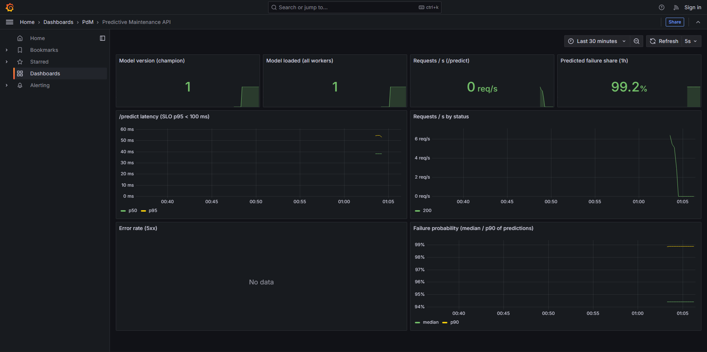
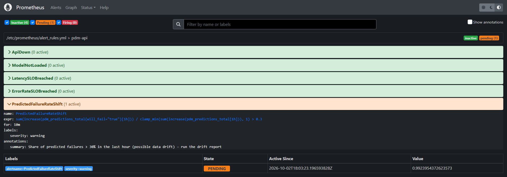
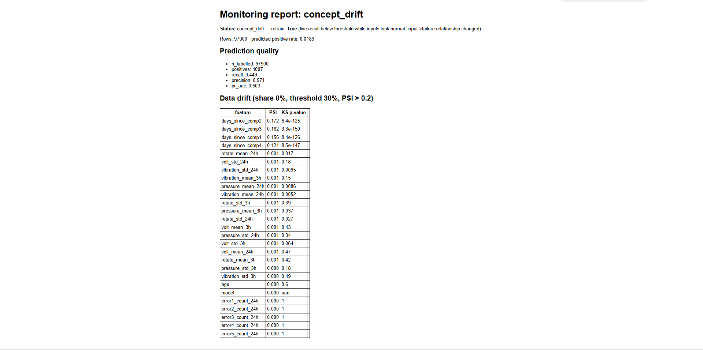

## 10. CI/CD

GitHub Actions (`.github/workflows/ci.yml`) มี 4 job:

| job | สิ่งที่ตรวจ |
|---|---|
| code-quality | ruff lint + format + pytest 48 test |
| data-validation | ข้อมูลปกติต้องผ่าน และข้อมูลเสียทั้ง 7 แบบต้องไม่ผ่าน |
| model-quality | รัน pipeline เต็ม ถ้า gate ไม่ผ่าน job จะพัง และเขียนตารางผล gate ลง Job Summary |
| docker-build | build image สำเร็จ |

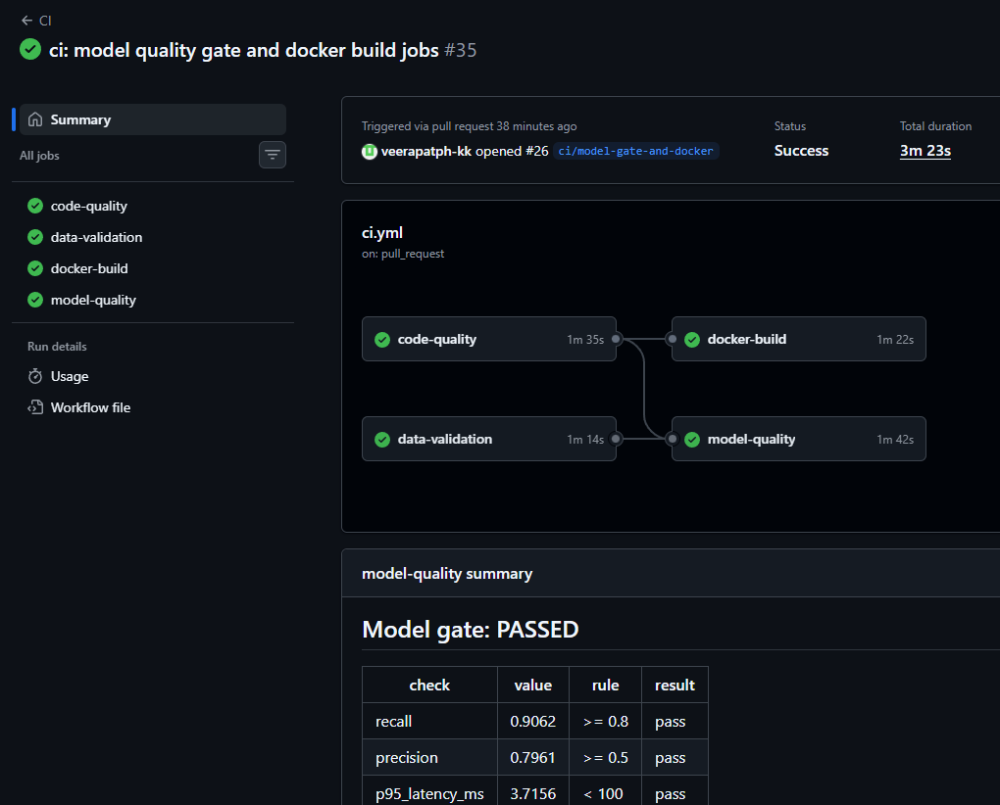

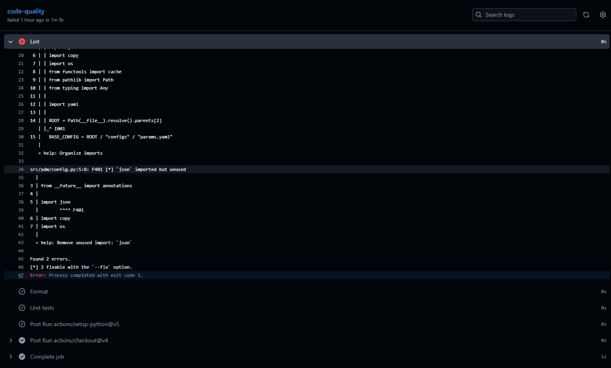
CI จับ import ที่ไม่ได้ใช้ (F401) ได้ ภาพนี้มาจาก CI ของ `main` ตอนที่สมาชิกแก้ไฟล์ผ่านหน้าเว็บจน commit ลง main โดยตรงระหว่างทดสอบ CI (ก่อนเปลี่ยน repo เป็น public ซึ่งตอนนั้นกฎป้องกัน main ยังไม่ถูกบังคับใช้) ทีมแก้กลับด้วย PR `fix: revert unused import committed directly to main`

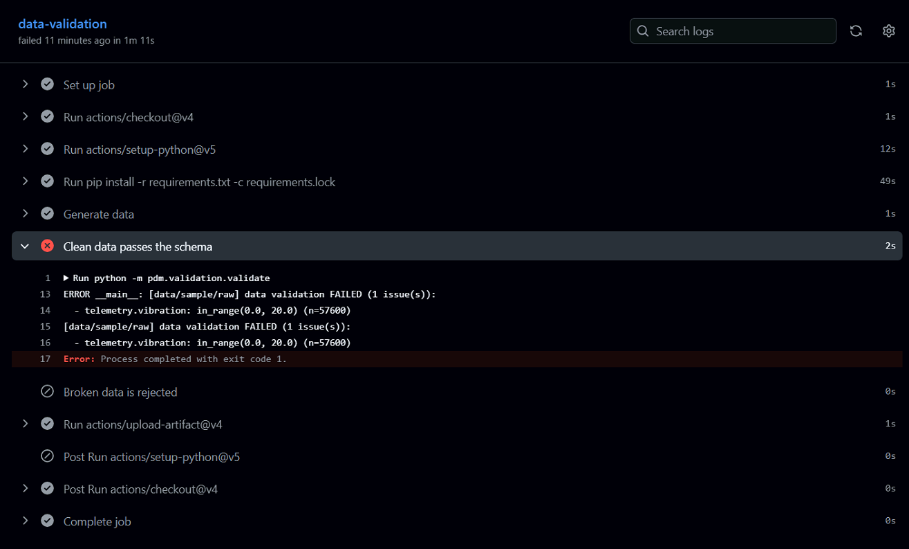

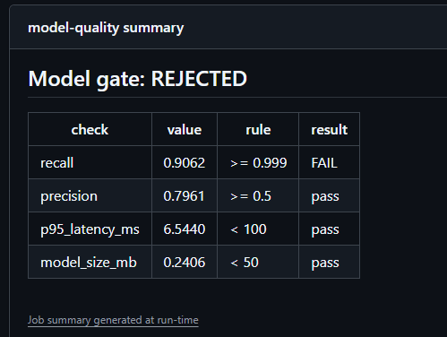
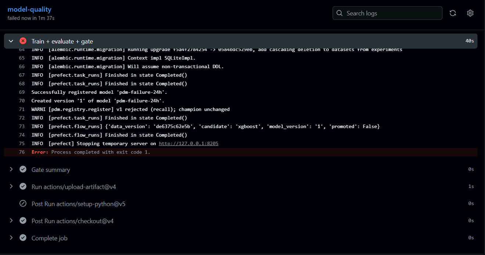

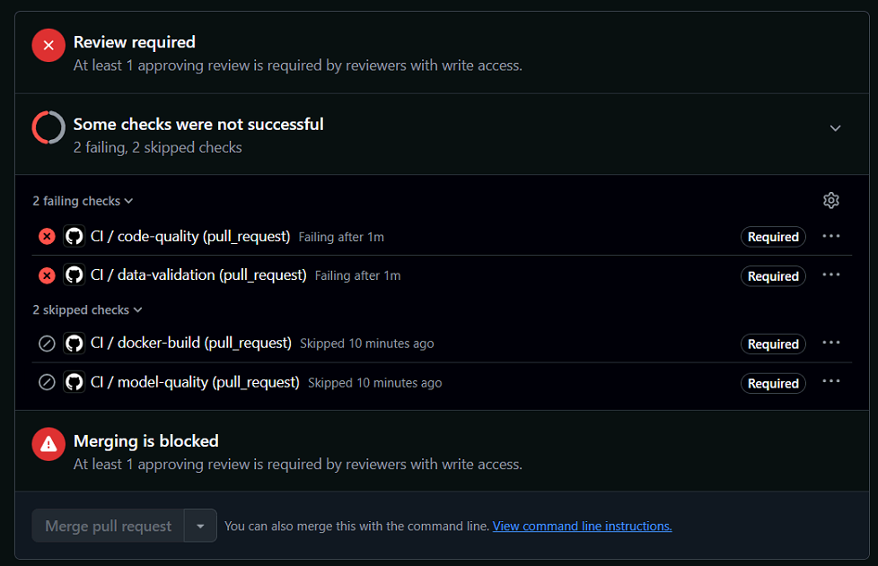

## 11. Pipeline และ Git

Prefect DAG `pdm-training-pipeline`:

`ingest → validate → build-features → split → save-reference → train → evaluate-gate → register → reload-api`

- สั่งรันด้วยคำสั่งเดียว
- ดูประวัติการรันใน Prefect UI ได้
- DAG `pdm-retrain-on-drift` ปิดวงจร monitoring → เทรนใหม่

**Git:** branch protection บน `main`, ทุกงานผ่าน Pull Request + review 1 คน + CI ผ่าน รวม 24 PR แบ่งตามเจ้าของงาน (ดู `docs/team/README.md`)

[ภาพ: หน้า Pull requests และ Insights → Contributors]

## 12. สถาปัตยกรรม

ดูแผนภาพที่ [architecture.md](architecture.md)

## 13. เหตุผลที่เลือกเครื่องมือ

ดูตารางใน [report_outline.md](report_outline.md)

## 14. การใช้เครื่องมือ AI

ทุกคนต้องเติมตารางใน [report_outline.md](report_outline.md) ตามจริงก่อนส่ง

## 15. ข้อจำกัดและงานต่อ

**ข้อจำกัด:**
- ข้อมูลจำลองทำให้ผลโมเดลดีเกินจริง
- ต้นทุน 50,000 / 5,000 บาทเป็นค่าสมมติ
- concurrency ≥ 8 ยังไม่ผ่าน SLO

**งานต่อ:**
- ใส่ load balancer ระดับ request หรือ scale API เป็นหลาย container
- เก็บ feedback จริงจากช่างเพื่อวัด recall ต่อเนื่อง
- ตั้งเวลาเทรนตามรอบด้วย Prefect deployment schedule
